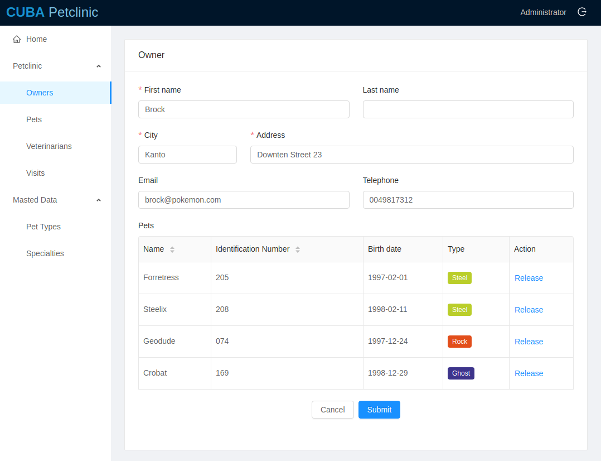

# CUBA Petclinic

  

CUBA Petclinic is a CUBA platform example application dealing with the domain of a petclinic. It is based on the commonly known [Spring Petclinic](https://github.com/spring-projects/spring-petclinic) example.

The CUBA Petclinic application deals with the domain of a Pet clinic and the associated business workflows to manage a pet clinic.

### React UI

React UI is placed in `modules/front`

## Domain Model

## Starting the Application

Use `CUBA Application` run task in CUBA Studio. 

React UI will be available at http://localhost:8080/petclinic-front

Generic UI will be available at http://localhost:8080/petclinic

### Staring React UI Dev Server

Navigate to `modules/front` and run `npm start` command. The dev server will be available at http://localhost:3000

